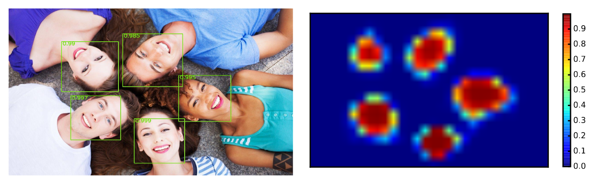

# Face recognition

---

## Abstract

- Я запутался
- Все статьи, которые я нашёл, делают что-то своё
- SOTA результаты это "настакаем слоёв"

---

## О чём будет доклад

### Face Detection

- Face Detection: Histogram of Oriented Gradients and Bag of Feature Method
- Multi-view Face Detection Using Deep Convolutional Neural Networks
- Joint Face Detection and Alignment using Multi-task Cascaded Convolutional Networks
- From Facial Parts Responses to Face Detection: A Deep Learning Approach

### Face Recognition

- FaceNet: A Unified Embedding for Face Recognition and Clustering
- DeepFace: Closing the Gap to Human-Level Performance in Face Verification
- Deep Face Recognition

---

# HOG

---
<!-- header: HOG -->

---

---

---

---
<!-- header: "" -->

# Multi-view Face Detection Using Deep CNNs

---

<!-- header: Multi-view Face Detection Using Deep CNNs -->

- Файнтюним AlexNet на детекцию лиц (просто пихаем ему картинки, где больше 50% это лицо и не лица)
- Жахаем sliding window на разные скейлы картинки чтобы выделить участки, где есть лицо
- Если заменить полносвязные слои на сверточные, то можно генерировать хитмапы

---

---
<!-- header: "" -->

# Cascaded CNN

---
<!-- header: Cascaded CNN -->

0. Заресайзить картинку несколько раз, делая "пирамиду изображений"
1. Пихаем картинку на вход простой сети для генерации претендентов на лицо, объединяем выходы
2. Пихаем кандидаты 1 стадии на вход новой сети, объединяем выходы
3. Пихаем кандидаты 2 стадии на вход новой сети, она выдает BB и лэндмарки

---

---

---
<!-- header: "" -->

# Deep Learning Approach

---
<!-- header: Deep Learning Approach -->

---
<!-- header: "" -->

# FaceNet

---
<!-- header: FaceNet -->

---

Хотим:

$\|f(x_i^a) - f(x_i^p)\|_2^2 + \alpha < \|f(x_i^a) - f(x_i^n)\|_2^2$

А значит:

$L = \sum_i^N \|f(x_i^a) - f(x_i^n)\|_2^2 - \|f(x_i^a) - f(x_i^p)\|_2^2 - \alpha$
